# Ex-01_DS_Data_Cleansing
# AIM
To read the given data and perform data cleaning and save the cleaned data to a file.

# Explanation
Data cleaning is the process of preparing data for analysis by removing or modifying data that is incorrect ,incompleted , irrelevant , duplicated or improperly formatted. Data cleaning is not simply about erasing data ,but rather finding a way to maximize datasets accuracy without necessarily deleting the information.

# ALGORITHM
## STEP 1
Read the given Data

## STEP 2
Get the information about the data

## STEP 3
Remove the null values from the data

## STEP 4
Save the Clean data to the file

# CODE FOR DATA 1
```
Name : SWETHA P
Register Number : 212222100053
*Data Cleaning - Data_set.csv*
import pandas as pd 
df = pd.read_csv("/content/Data_set.csv")
import numpy as np
import pandas as pd
import seaborn as sbn
df = pd.read_csv("/content/Data_set.csv")
print(df)
df.head(10)
df.info()
df.isnull()
df.isnull().sum()
df['show_name'] = df['show_name'].fillna(df['aired_on'].mode()[0])
df['aired_on'] = df['aired_on'].fillna(df['aired_on'].mode()[0])
df['original_network'] = df['original_network'].fillna(df['aired_on'].mode()[0])
df.head()
df['rating'] = df['rating'].fillna(df['rating'].mean())
df['current_overall_rank'] =df['current_overall_rank'].fillna(df['current_overall_rank'].mean())
df.head()
df['watchers'] = df['watchers'].fillna(df['watchers'].median())
df.head()
df.info()
df.isnull().sum()
```


# OUTPUT FOR DATA 1

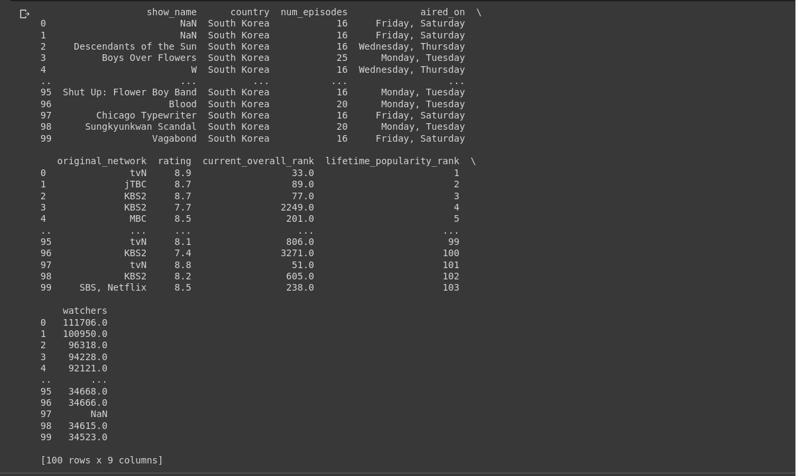


# BEFORE CLEANING


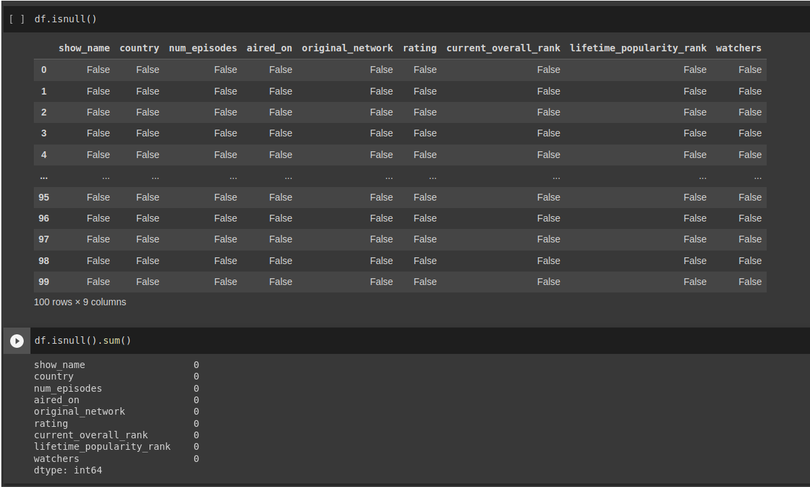


# MODE

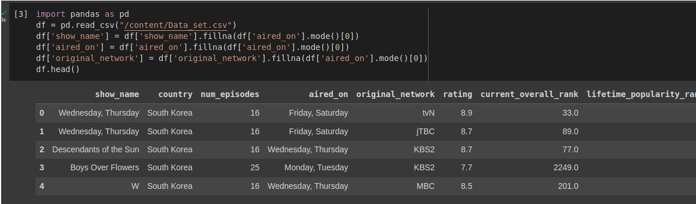

# MEAN

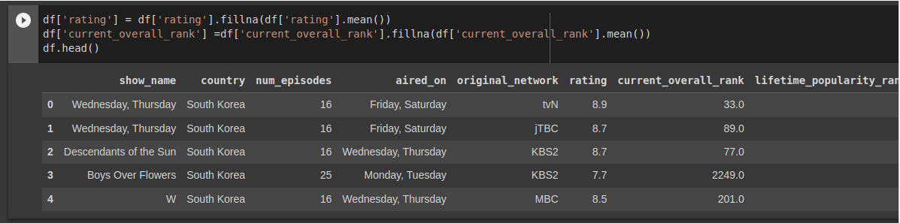

# MEDIAN

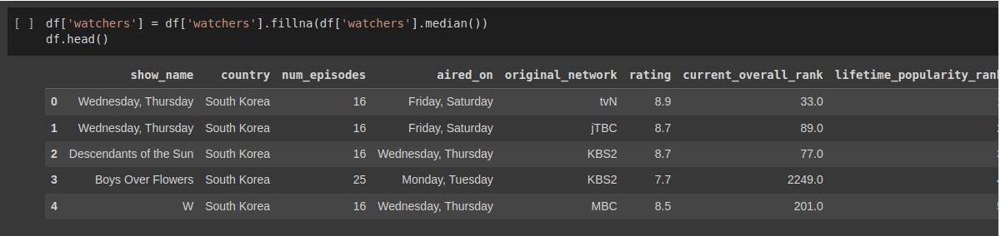


# AFTER CLEANING

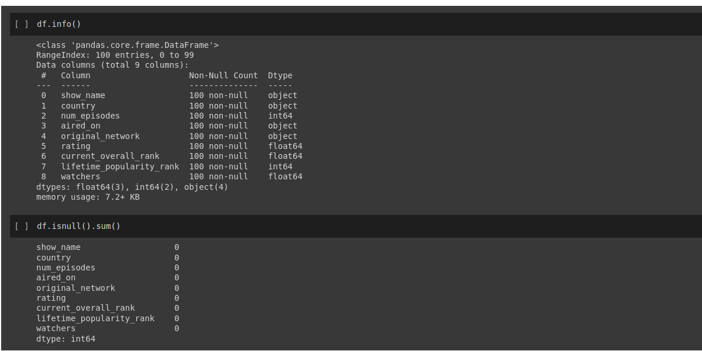


# CODE FOR DATA 2
```
Name :SWETHA P
Register Number : 212222100053
mport pandas as pd
import numpy as np
import seaborn as sns
from google.colab import files
uploaded = files.upload()
df = pd.read_csv("Loan_data.csv")
df
df.head(5)
df.describe()
df.info()
df.tail()
df.isnull()
df.isnull().sum()
df.shape
df.columns
df.duplicated()
df['Gender'] = df["Gender"].fillna(df['Gender'].mode()[0])
df['Married'] = df["Married"].fillna(df['Married'].mode()[0])
df['Self_Employed'] = df["Self_Employed"].fillna(df['Self_Employed'].mode()[0])
df['LoanAmount'] = df['LoanAmount'].fillna(df['LoanAmount'].mean())
df['Loan_Amount_Term'] = df['Loan_Amount_Term'].fillna(df['Loan_Amount_Term'].mean())
df['Credit_History'] = df['Credit_History'].fillna(df['Credit_History'].mean())
sns.boxplot(y="LoanAmount",data=df)
df['LoanAmount']=df['LoanAmount'].fillna(df['LoanAmount'].median())
df.head()
df.isnull().sum()
df.info()
```


# OUTPUT FOR DATA 2


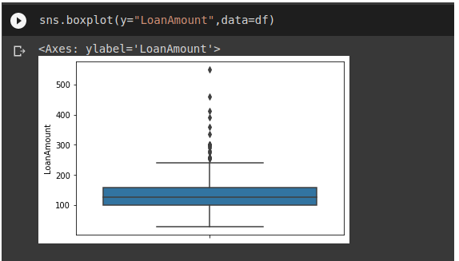


# BEFORE CLEANING

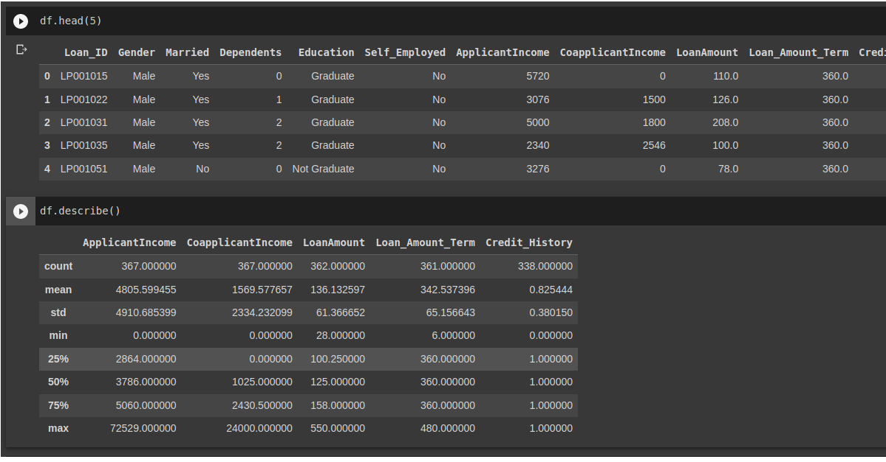

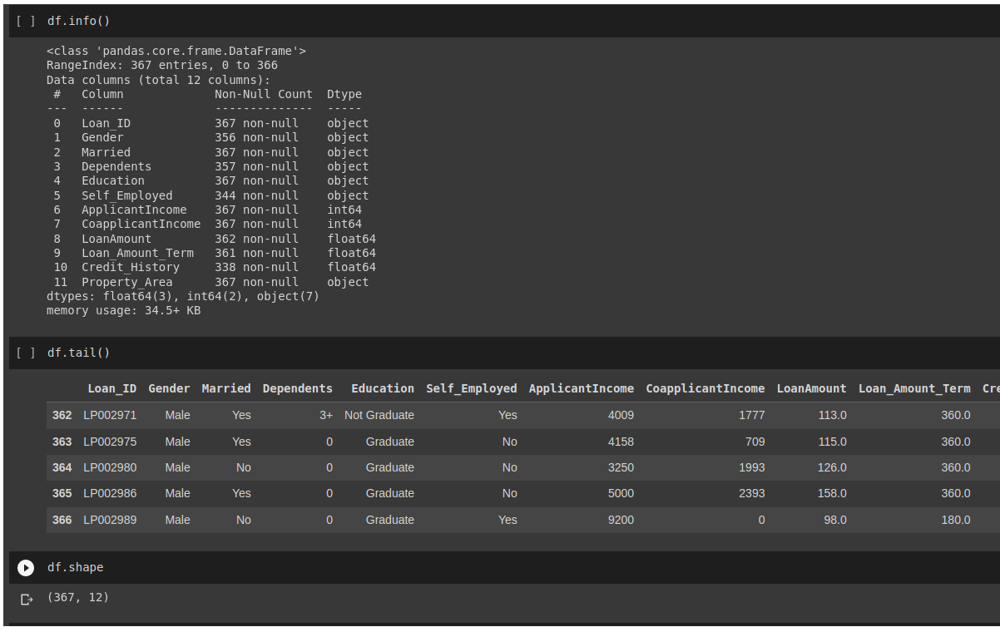

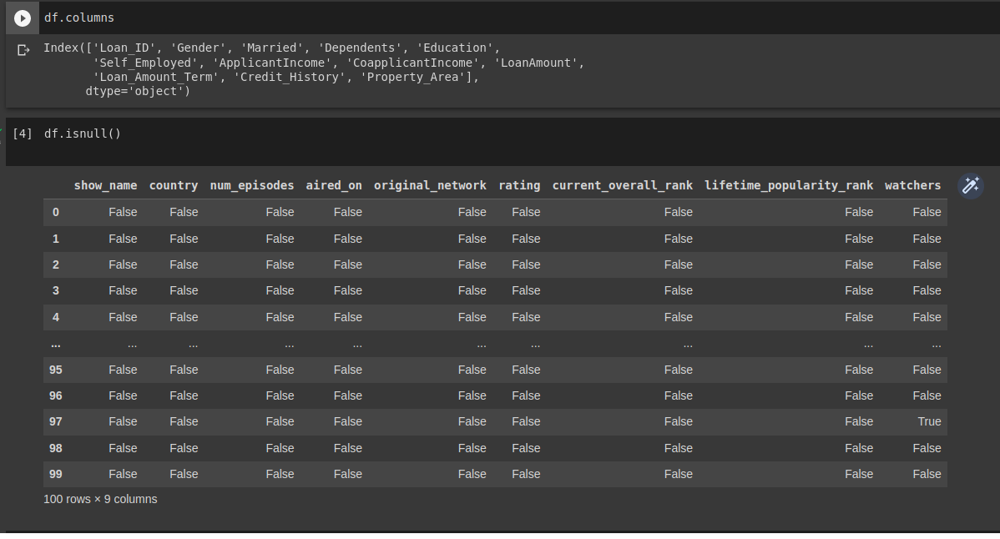

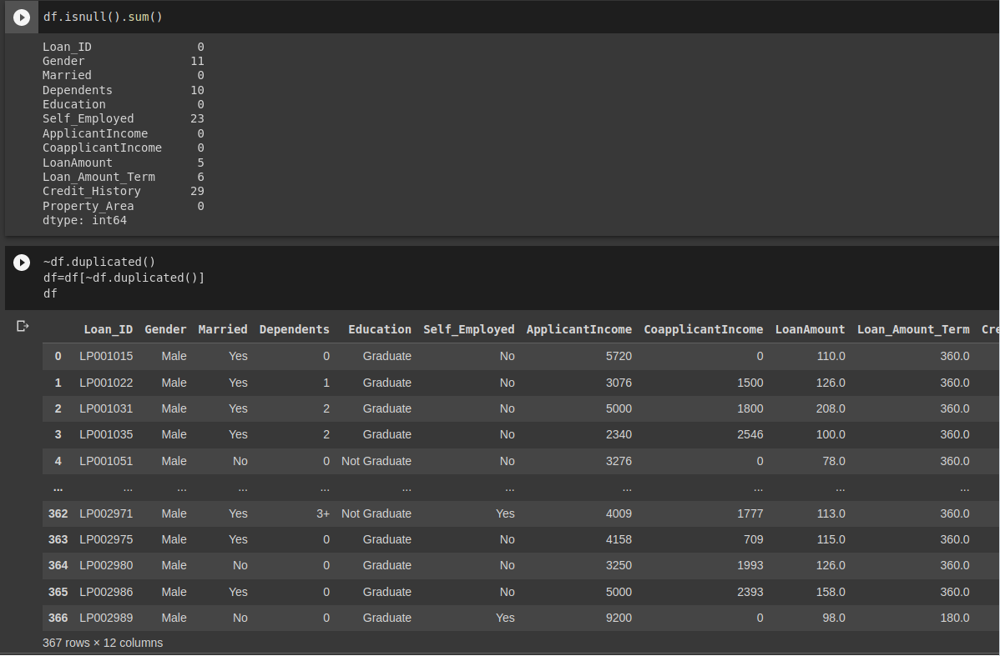


# MODE

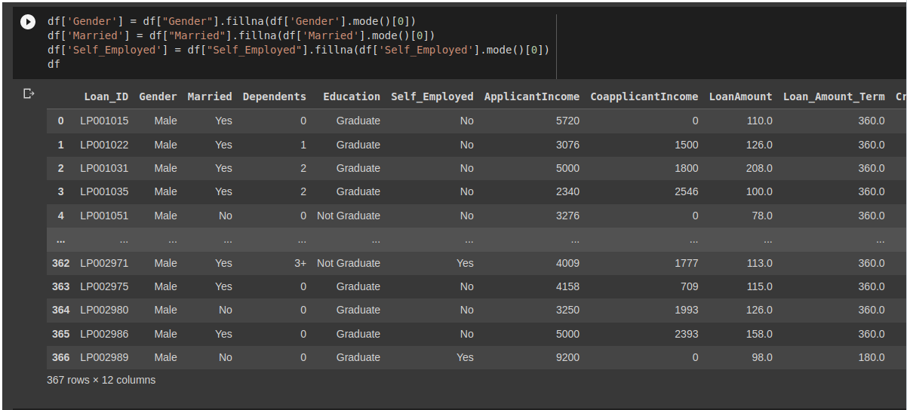


# MEAN

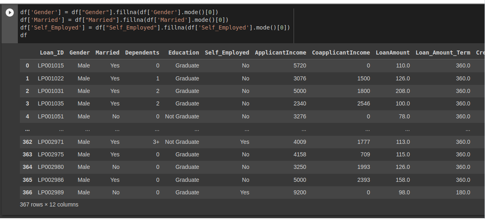


# MEDIAN

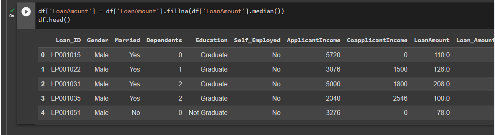


# AFTER CLEANING

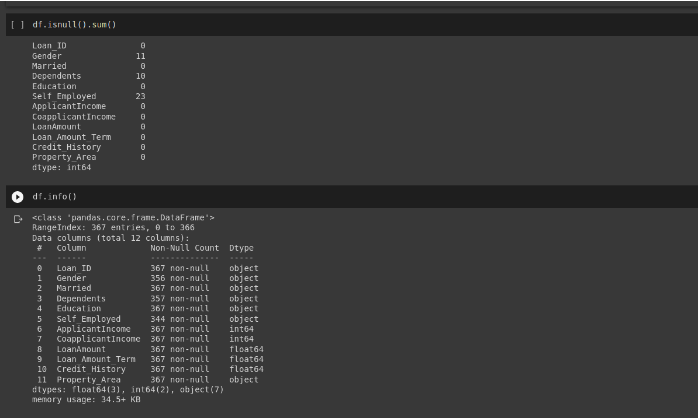


# RESULT

Thus the given data is read,cleansed and cleaned data is saved into the file.


